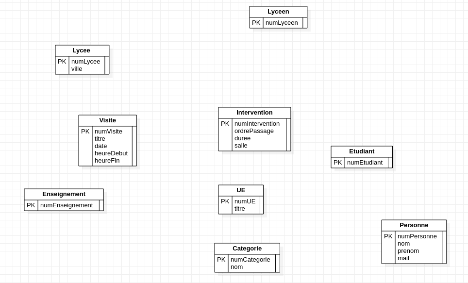
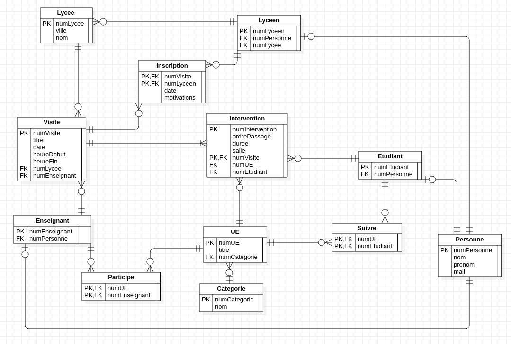

# Rendu TP4 Tom Taffin Rémi Andrieu

## ex1

### q1

Erreur : Enseignant au lieu de Enseignement.

### q2
La relation est "contenir", entre Visite et Intervention, modifie les clés primaires.
Toutes les relations modifient les clés étrangères, sauf "inscription" entre Visite et Lyceen, "participer à" entre Enseignant et UE et "suivre" entre UE et Etudiant

### q3
En premier les compositions (R1\*c), puis les relations R1\*, R1\*p, R011 et R011p, puis les relations R01\* et R01\*p, et enfin les relations R\*\* et R\*\*p.

### q4 

## ex2

Nous avons pris la décision de mettre NOT NULL à tous les attributs non clés étrangères/primaires, en supposant qu'ils doivent être renseignés.