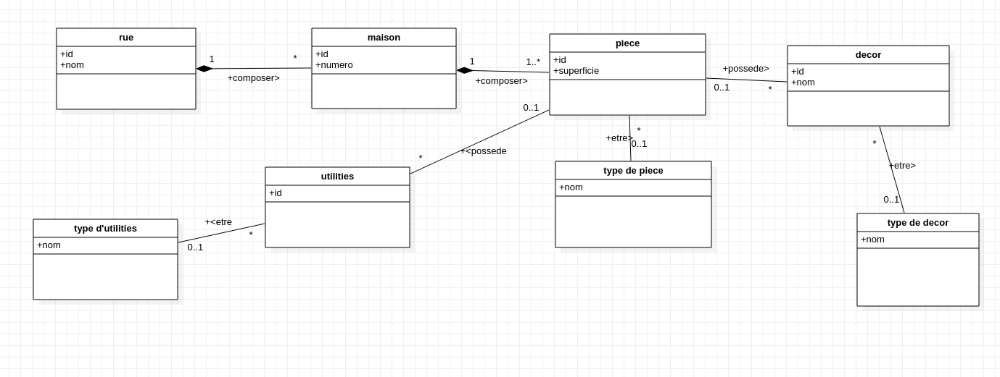
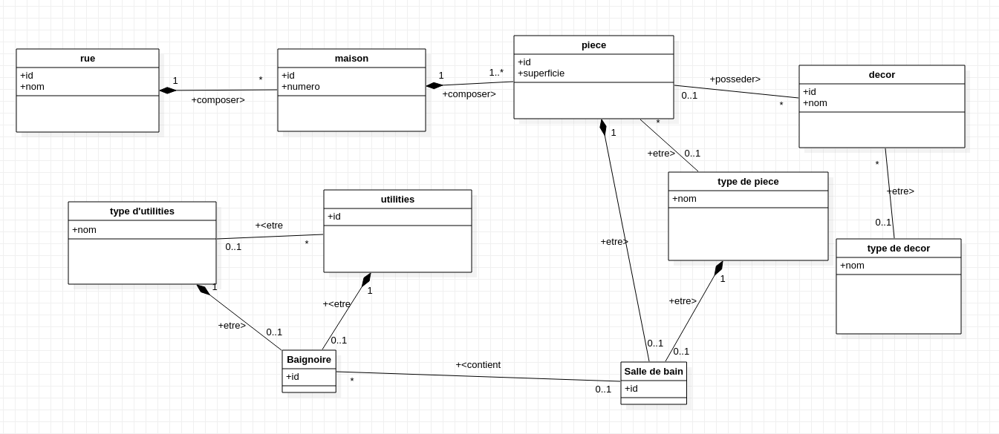
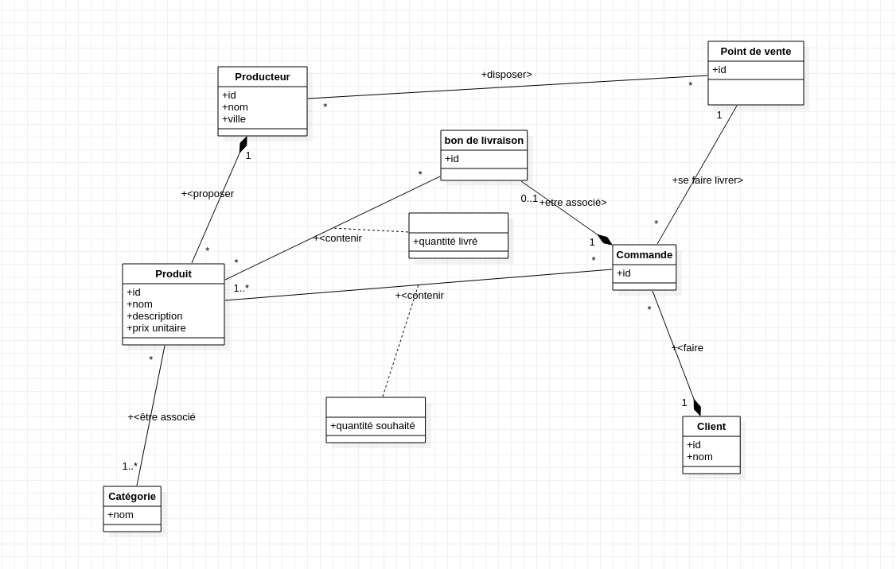

# Rendu TP2 Tom Taffin Rémi Andrieu

## ex1

1) On crée une entité rue et maison. Une rue est composée de maisons. Si la rue est détruite les maisons qui la compose sont détruite.

2) On ajoute une propriété numero à l'entité maison.

3) On crée une entité piece. Une maison est composée de piece et si la maison est détruite les pieces qui la compose le sont aussi. Une maison contient au moins une piece.

4) On ajoute une propriété superficie à l'entité piece. On crée une entité type de piece qui représente les différent type de piece. Une piece peut être d'aucun type et une piece ne peut pas avoir plusieurs types.

5) On crée une entité utilities et decor. les utilities et les décors ne peuvent être que dans au plus une piece. L'entité type d'utilities renseigne le type de l'utilities. Un utilities peut être d'aucun ou d'un seul type. Pareil pour les décors. 

6) Un moyen d'imposer cette contrainte est de différencier les différents types de piece et les types d'utilities dans des nouvelles entités grâce à de l'héritage.
En prenant l'exemple de la salle de bain, une piece peut etre ou non une salle de bain mais doit être au maximum d'un type de pièce. De même pour les utilities. 

## ex2

1) On crée une entité producteur avec les propriétés id, nom et ville.

2) On crée une entité point de vente. Un producteur peut disposer de zero ou plusieurs points de vente. Un point de vente peut être accessible par zero ou plusieurs producteurs.

3) On crée une entité produit avec les propriétés id, nom, description et prix unitaire. Un producteur peut proposer 0 ou plusieurs produits. Un produit n'est proposé que par un seul producteur. Si un producteur est détruit, ses produits le sont aussi.

4) On crée une entité catégorie. Un catégorie comporte 0 ou plusieurs produits. Un produit est au moins contenu dans une catégorie.

5)  On crée une entité client et une entité commande.  
Une commande est effectuée par un client. Un client peut effectuer 0 ou plusieurs commandes. Si un client est détruit ses commandes le sont aussi.   
Une commande se fait livrer dans un point de vente. Un point de vente peut se faire livrer 0 ou plusieurs commandes.

6) Une commande contient 1 ou plusieurs produits, ainsi que chaque quantité renseigné dans une relation porteuse d'information. Un produit peut être présent dans 1 ou plusieurs commandes. 

7) Il faudrait connaitre les différents point de ventes disponibles par tous les produits, sachant qu'il est possible qu'aucun point de vente ne soit disponible. 
Pour l'ensemble des produits il faut donc récupérer tous les points de ventes accessibles et recupérer seulement les points de ventes présent sur l'ensemble des produits. 
Ceci n'est pas faisable avec un mcd.

8) On créé une entité bon de livraison. Un bon de livraison contient 0 ou plusieurs produits, ainsi que chaque quantité livrée renseigné dans une relation porteuse d'information.
Grâce à cette relation, on a accès au prix à payer pour chaque produit, et donc au montant total de la livraison.
Un bon de livraison est associé à une unique commande. Une commande est associé à 0 ou 1 bon de livraison. Si une commande est détruite, son bon de livraison aussi. Par cette relation, nous avons accès à la liste des quantités souhaitées.

