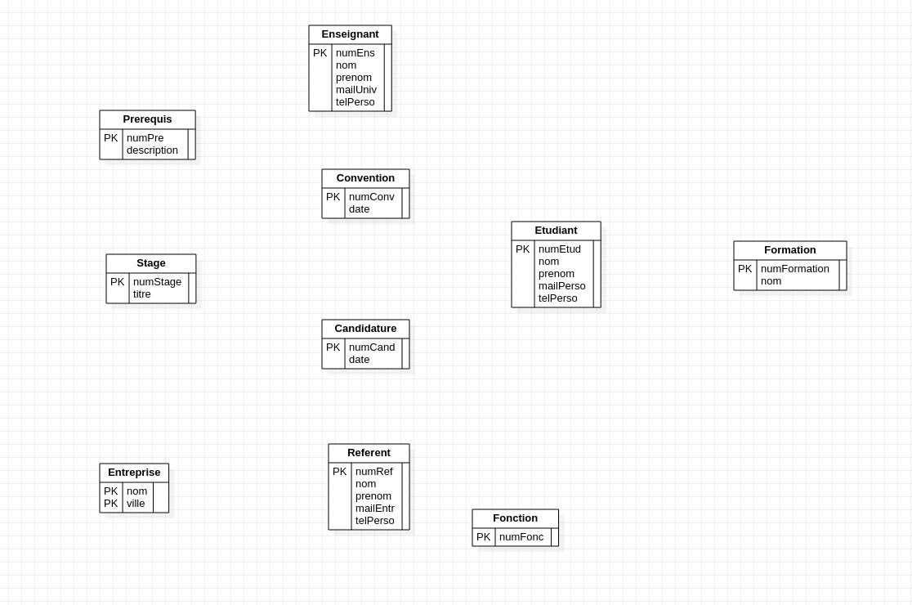
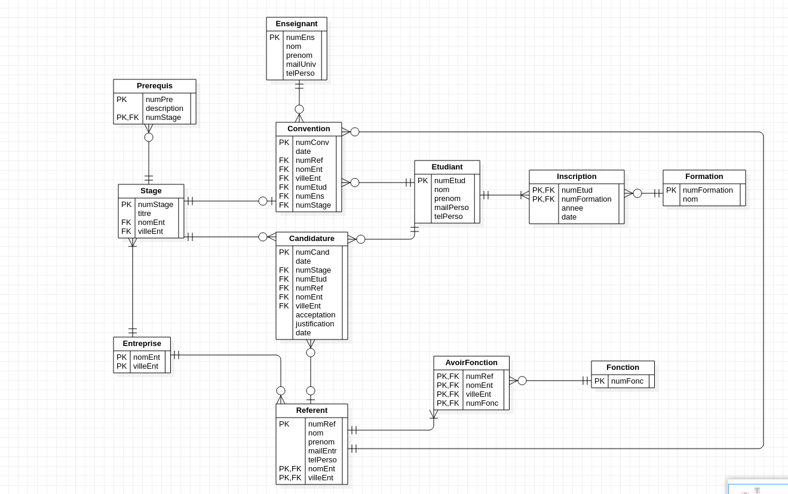
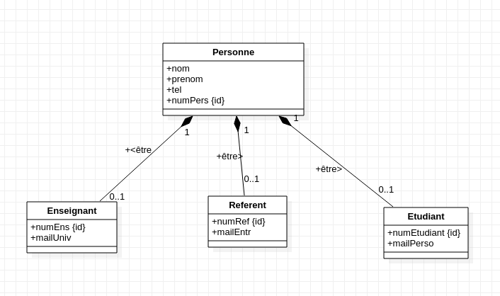
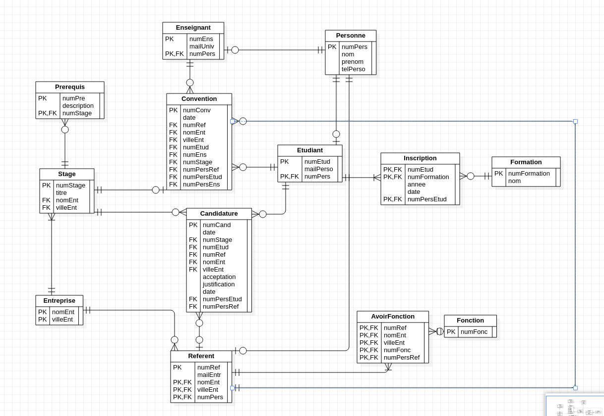

# Rendu TP3 Tom Taffin Rémi Andrieu

## ex1

### q1

### q2
Les relations sont Requerir, entre Stage et Prerequis, et Designer, entre Entreprise et Referent.

### q3
En premier les compositions (R1\*c), puis les relations R1\*, R1\*p, R011 et R011p, puis les relations R01\* et R01\*p, et enfin les relations R\*\* et R\*\*p.

### q4 
On suppose que presque toutes les candidatures sont évaluées par un référent.

## ex2

### q1
Le MCD de l'héritage sur Personne

### q2

Une nouvelle table Personne est créée et les tables Etudiant, Enseignant, Referent, Convention, Candidature, Inscription et AvoirFonction sont impactées.

